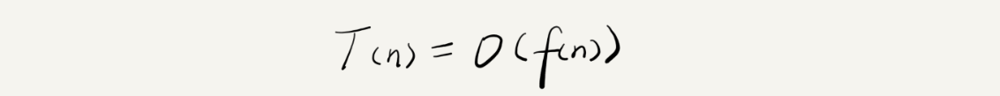
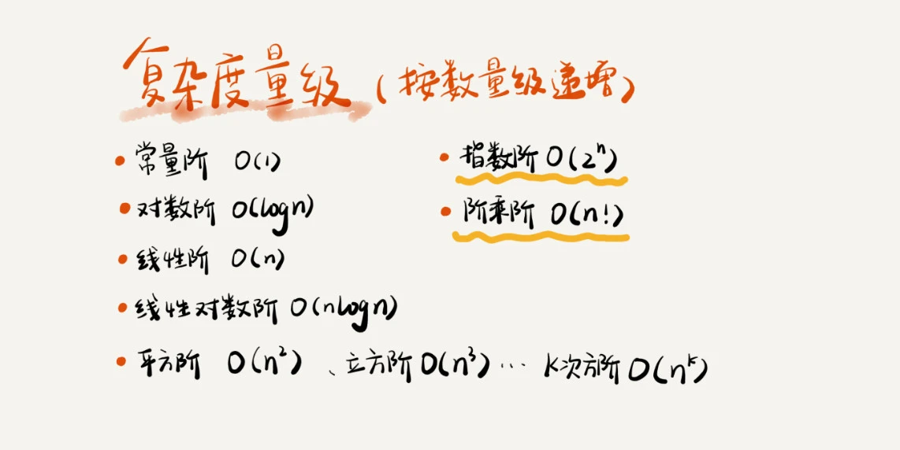

#复杂度分析（上）：如何分析、统计算法的执行效率和资源消耗？

[TOC]

数据结构和算法本身解决的是“快”和“省”的问题，即如何让代码运行得更快，如何让代码更省存储空间。

代码跑一遍，通过统计、监控，就能得到算法执行的时间和占用的内存大小。叫**事后统计法**，局限性：
1. 测试结果非常依赖测试环境
2. 测试结果受数据规模的影响很大

##大O复杂度表示法

所有代码的执行时间 T(n) 与每行代码的执行次数成正比。
所有代码的执行时间 T(n) 与每行代码的执行次数 f(n) 成正比。

> T(n) 我们已经讲过了，它表示代码执行的时间；n 表示数据规模的大小；f(n) 表示每行代码执行的次数总和。因为这是一个公式，所以用 f(n) 来表示。公式中的 O，表示代码的执行时间 T(n) 与 f(n) 表达式成正比。

**大 O 时间复杂度**实际上并不具体表示代码真正的执行时间，而是表示**代码执行时间随数据规模增长的变化趋势**，所以，也叫作**渐进时间复杂度（asymptotic time complexity）**，简称**时间复杂度**。

而公式中的低阶、常量、系数三部分并不左右增长趋势，所以都可以忽略。

###时间复杂度分析

三个实用方法。

####1. 只关注循环执行次数最多的一段代码

大 O 这种复杂度表示方法只是表示一种变化趋势。我们通常会忽略掉公式中的常量、低阶、系数，只需要记录一个最大阶的量级就可以了。所以，**我们在分析一个算法、一段代码的时间复杂度的时候，也只关注循环执行次数最多的那一段代码就可以了。**

####2. 加法法则：总复杂度等于量级最大的那段代码的复杂度

T1(n)=O(f(n))，T2(n)=O(g(n))；那么 T(n)=T1(n)+T2(n)=max(O(f(n)), O(g(n))) =O(max(f(n), g(n))).

####3. 乘法法则：嵌套代码的复杂度等于嵌套内外代码复杂度的乘积

(n)=T1(n)*T2(n)=O(f(n))*O(g(n))=O(f(n)*g(n)).

假设 T1(n) = O(n)，T2(n) = O(n2)，则 T1(n) * T2(n) = O(n3)

####几种常见时间复杂度实例分析

复杂度量级，我们可以粗略地分为两类，多项式量级和非多项式量级。其中，非多项式量级只有两个：O(2n) 和 O(n!)。

复杂度量级，我们可以粗略地分为两类，多项式量级和非多项式量级。其中，非多项式量级只有两个：O(2n) 和 O(n!)。

几种常见的多项式时间复杂度。

#####O(1)

一般情况下，只要算法中不存在循环语句、递归语句，即使有成千上万行的代码，其时间复杂度也是Ο(1)。

#####2. O(logn)、O(nlogn)

对数阶时间复杂度非常常见，同时也是最难分析的一种时间复杂度。

对数之间是可以互相转换的，log3n 就等于 log32 * log2n，所以 O(log3n) = O(C * log2n)，其中 C=log32 是一个常量。基于我们前面的一个理论：**在采用大 O 标记复杂度的时候，可以忽略系数，即 O(Cf(n)) = O(f(n))**。所以，O(log2n) 就等于 O(log3n)。因此，在对数阶时间复杂度的表示方法里，我们忽略对数的“底”，统一表示为 O(logn)。

如果一段代码的时间复杂度是 O(logn)，我们循环执行 n 遍，时间复杂度就是 O(nlogn) 了。而且，O(nlogn) 也是一种非常常见的算法时间复杂度。比如，归并排序、快速排序的时间复杂度都是 O(nlogn)。

######3. O(m+n)、O(m*n)

代码的复杂度由**两个数据的规模**来决定。

T1(m) + T2(n) = O(f(m) + g(n))。但是乘法法则继续有效：T1(m)*T2(n) = O(f(m) * f(n))。

###空间复杂度分析

时间复杂度的全称是**渐进时间复杂度，表示算法的执行时间与数据规模之间的增长关系**。类比一下，空间复杂度全称就是**渐进空间复杂度（asymptotic space complexity），表示算法的存储空间与数据规模之间的增长关系**。

复杂度就是 O(1)、O(n)、O(n^2 )，像 O(logn)、O(nlogn) 这样的对数阶复杂度平时都用不到。

