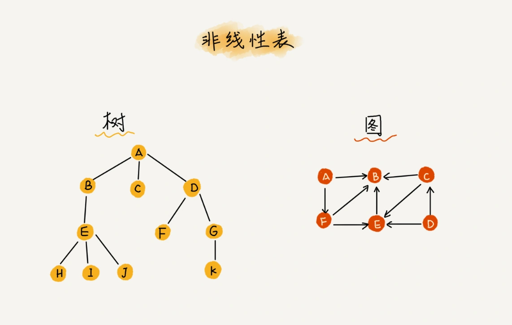

#数据结构一：数组、

[TOC]

1.**数组（Array）是一种线性表数据结构。它用一组连续的内存空间，来存储一组具有相同类型的数据。**
2.数组支持随机访问，根据下标随机访问的时间复杂度为O(1),插入和删除的时间复杂度为O(n).
3.无序优化插入可以将插入元素k直接移动到末尾，不追求数组数据的连续性删除优化可以先标记，直到数据内存空间不够才批量删除。避免插入和删除为了保持内存空间的连续性而搬移插入或删除元素之后的数据。


##如何实现随机访问？

**数组（Array）是一种线性表数据结构。它用一组连续的内存空间，来存储一组具有相同类型的数据。**
- 第一是**线性表（Linear List）**。顾名思义，线性表就是数据排成像一条线一样的结构。每个线性表上的数据最多只有前和后两个方向。其实除了数组，链表、队列、栈等也是线性表结构。


- 而与它相对立的概念是**非线性表**，比如二叉树、堆、图等。之所以叫非线性，是因为，在非线性表中，数据之间并不是简单的前后关系。



- 第二个是**连续的内存空间和相同类型的数据**。正是因为这两个限制，它才有了一个堪称“杀手锏”的特性：“随机访问”。但有利就有弊，这两个限制也让数组的很多操作变得非常低效，比如要想在数组中删除、插入一个数据，为了保证连续性，就需要做大量的数据搬移工作。

数组是适合查找操作，但是查找的时间复杂度并不为 O(1)。即便是排好序的数组，你用二分查找，时间复杂度也是 O(logn)。所以，正确的表述应该是，数组支持随机访问，根据下标随机访问的时间复杂度为 O(1)。

##低效的“插入”和“删除”

###插入

假设数组的长度为 n，现在，如果我们需要将一个数据插入到数组中的第 k 个位置。为了把第 k 个位置腾出来，给新来的数据，我们需要将第 k～n 这部分的元素都顺序地往后挪一位。因为我们在每个位置插入元素的概率是一样的，所以平均情况时间复杂度为 (1+2+...n)/n=O(n)。

如果数组中的数据是有序的，我们在某个位置插入一个新的元素时，就必须按照刚才的方法搬移 k 之后的数据。但是，如果数组中存储的数据并没有任何规律，数组只是被当作一个存储数据的集合。在这种情况下，如果要将某个数据插入到第 k 个位置，为了避免大规模的数据搬移，我们还有一个简单的办法就是，直接将第 k 位的数据搬移到数组元素的最后，把新的元素直接放入第 k 个位置。

###删除

如果我们要删除第 k 个位置的数据，为了内存的连续性，也需要搬移数据，不然中间就会出现空洞，内存就不连续了。

和插入类似，如果删除数组末尾的数据，则最好情况时间复杂度为 O(1)；如果删除开头的数据，则最坏情况时间复杂度为 O(n)；平均情况时间复杂度也为 O(n)。

在某些特殊场景下，我们并不一定非得追求数组中数据的连续性。如果我们将多次删除操作集中在一起执行，删除的效率是不是会提高很多呢？

我们可以先记录下已经删除的数据。每次的删除操作并不是真正地搬移数据，只是记录数据已经被删除。当数组没有更多空间存储数据时，我们再触发执行一次真正的删除操作，这样就大大减少了删除操作导致的数据搬移。

##容器能否完全替代数组？

ArrayList 最大的优势就是可以将很多数组操作的细节封装起来。比如前面提到的数组插入、删除数据时需要搬移其他数据等。另外，它还有一个优势，就是支持**动态扩容。**

数组本身在定义的时候需要预先指定大小，因为需要分配连续的内存空间。如果我们申请了大小为 10 的数组，当第 11 个数据需要存储到数组中时，我们就需要重新分配一块更大的空间，将原来的数据复制过去，然后再将新的数据插入。

不过，这里需要注意一点，因为扩容操作涉及内存申请和数据搬移，是比较耗时的。所以，如果事先能确定需要存储的数据大小，最好**在创建 ArrayList 的时候事先指定数据大小。**

对于业务开发，直接使用容器就足够了，省时省力。毕竟损耗一丢丢性能，完全不会影响到系统整体的性能。但如果你是做一些非常底层的开发，比如开发网络框架，性能的优化需要做到极致，这个时候数组就会优于容器，成为首选。

##为什么大多数编程语言中，数组要从 0 开始编号，而不是从 1 开始呢？

从数组存储的内存模型上来看，“下标”最确切的定义应该是“偏移（offset）”。前面也讲到，如果用 a 来表示数组的首地址，a[0]就是偏移为 0 的位置，也就是首地址，a[k]就表示偏移 k 个 type_size 的位置，所以计算 a[k]的内存地址只需要用这个公式：
```
a[k]_address = base_address + k * type_size
```

数组作为非常基础的数据结构，通过下标随机访问数组元素又是其非常基础的编程操作，效率的优化就要尽可能做到极致。所以为了减少一次减法操作，数组选择了从 0 开始编号，而不是从 1 开始。

，说数组起始编号非 0 开始不可。所以我觉得最主要的原因可能是历史原因。

